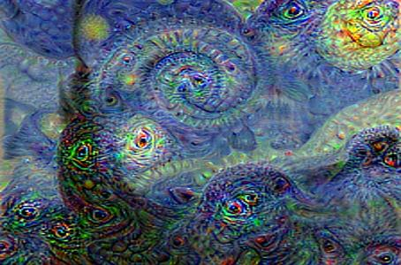
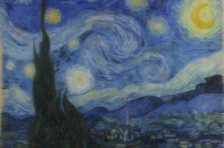

# DeepDream
uses a convolutional neural network to find and enhance patterns in images via algorithmic pareidolia, thus creating a dream-like appearance reminiscent of a psychedelic experience in the deliberately overprocessed images.
#
# Original Image

# Genarated with Pytorch(torch_VGG16)

# Genarated with my_VGG16
 After 50 epochs, I trained my VGG16 with the CIFAR-10 dataset.
 

